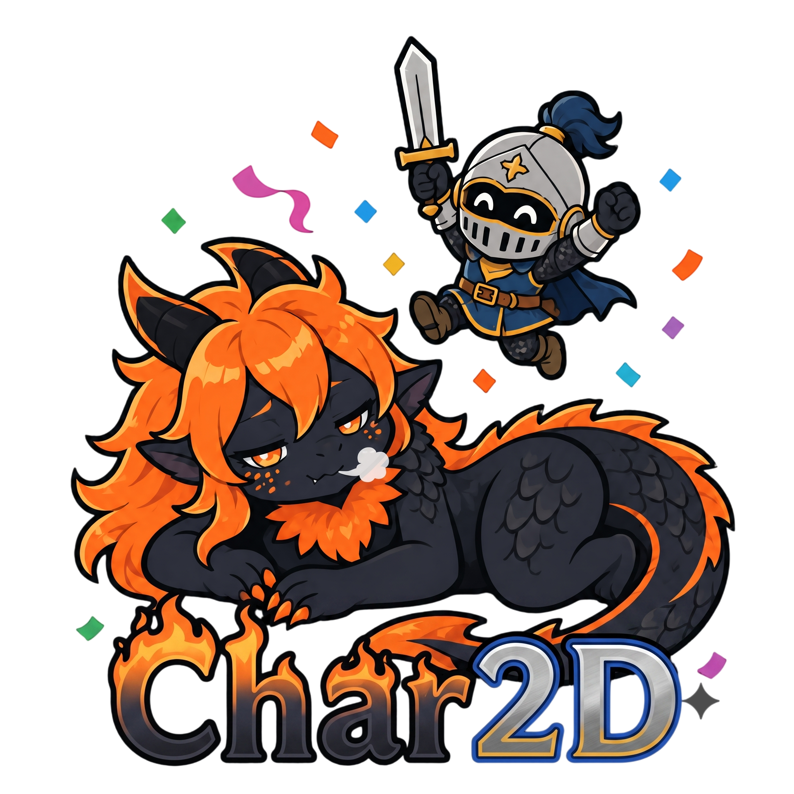

---

_A 2D game engine built in **[Beef Lang](https://www.beeflang.org/)** for grid-based RPGs, featuring hybrid turn-based combat and active bullet dodging._

---

## **Documentation & How to Run the Project Locally**

The full documentation and help website can be accessed at **[This Website](https://edulobom.github.io/Char2D/)**. The website is built using **[Docusaurus](https://docusaurus.io/)** and is isolated within the `docs/` folder.

For complete contribution guidelines, coding standards, and detailed instructions on how to run both the engine and the documentation site locally, please read the **[How to Contribute & Run](https://edulobom.github.io/Char2D/docs/contributing/)** guide.

---

Made with ❤️ by **[EduLoboM](https://github.com/EduLoboM)**

