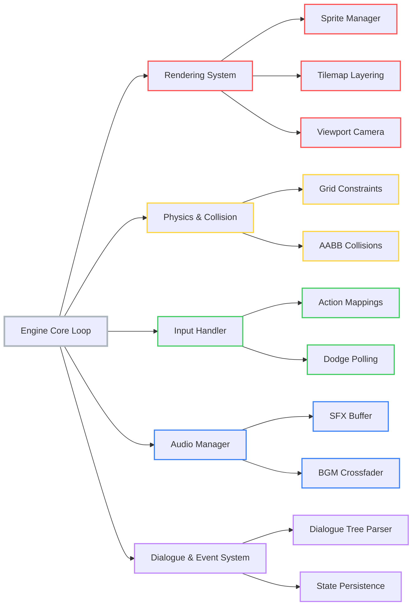

# Engine Architecture

Architecture breakdown of the **Char2D** game engine built in Beef Lang.

---

## System Architecture Tree

The following diagram maps the primary systems, core components, and their sub-modules:

